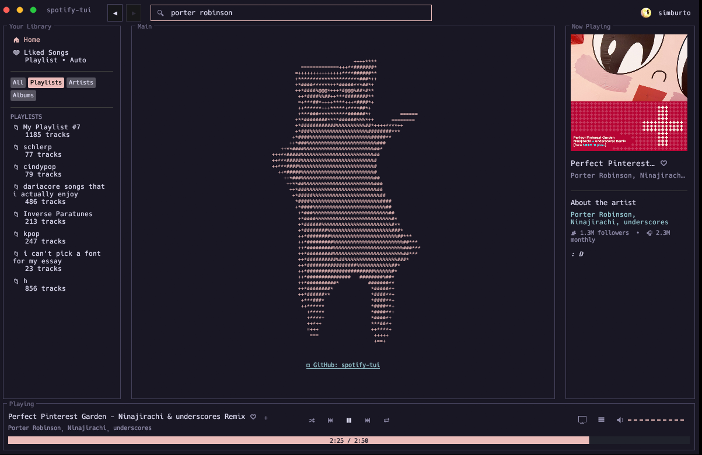
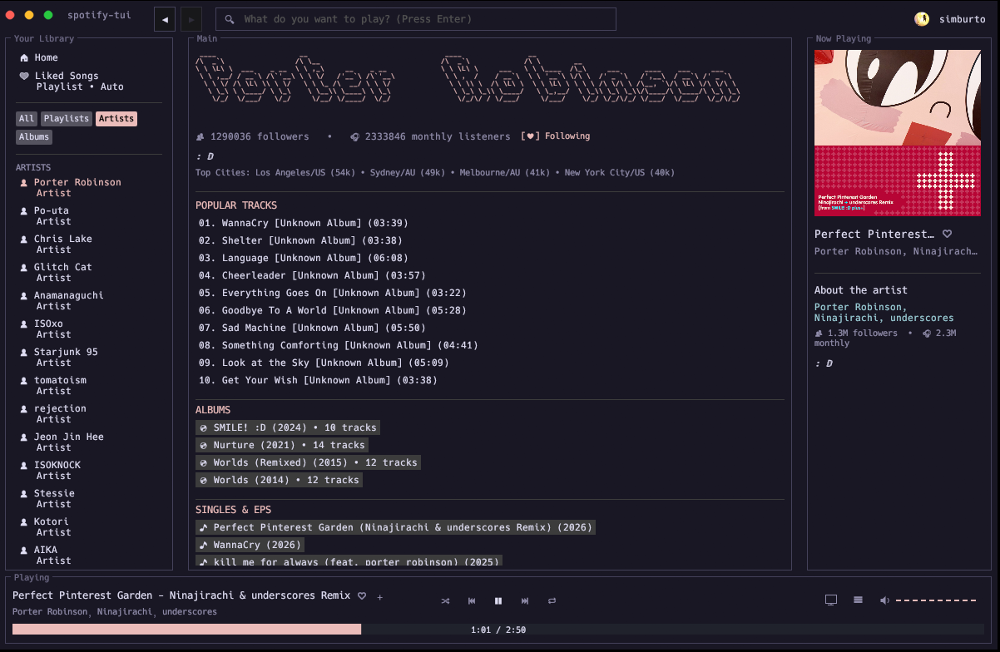
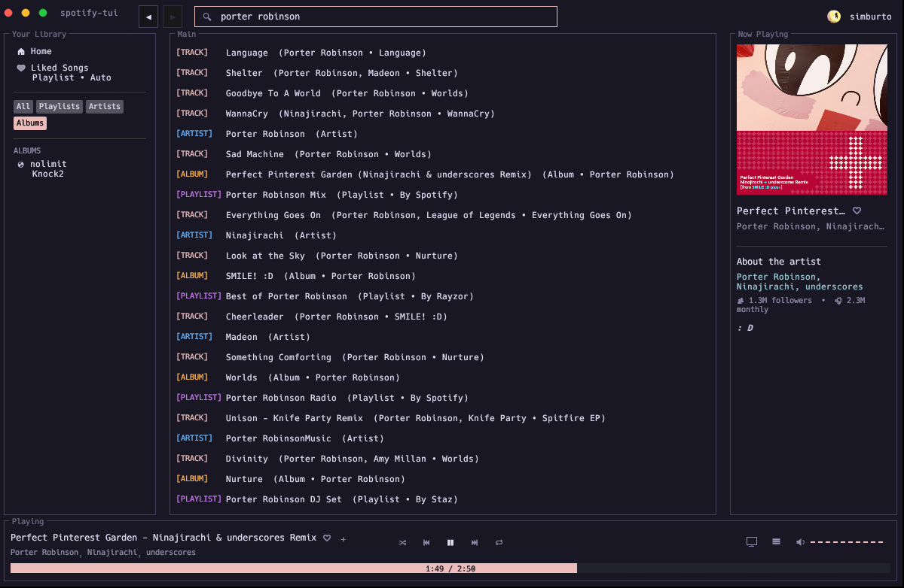

# spotify-tui

A standalone desktop client built with Rust that interfaces with a minimal headless Linux guest via QEMU. It captures lossless audio streams from Spotify Soloist running inside the micro-VM.

---



## Architecture Overview

```text
┌─────────────────────────────────────────────────────────────┐
│ Windows Host (eframe / WASAPI)                              │
│                                                             │
│  ┌────────────────────┐         ┌───────────────────────┐   │
│  │  spotify-tui GUI   │         │ WASAPI Shared Engine  │   │
│  │  (egui Frontend)   │         │ (Rubato Resampler)    │   │
│  └─────────┬──────────┘         └───────────▲───────────┘   │
│            │ (Port 3000 WebSocket)          │ (Port 4714)   │
│            │ Control & Metadata             │ S24LE PCM Raw │
└────────────┼────────────────────────────────┼───────────────┘
             ▼                                │
┌─────────────────────────────────────────────┼───────────────┐
│ QEMU Guest (Micro-VM Linux Kernel)          │               │
│                                             │               │
│  ┌────────────────────┐          ┌──────────┴────────────┐  │
│  │  Spotify Soloist   ├─────────►│ PulseAudio Null Sink  │  │
│  │ (Spotify Connect)  │          │ (module-simple-tcp)   │  │
│  └────────────────────┘          └───────────────────────┘  │
└─────────────────────────────────────────────────────────────┘

```

* **Frontend UI**: Built in Rust using `eframe`/`egui`.


* **Audio Loopback**: PulseAudio outputs raw lossless audio via `module-simple-protocol-tcp` on port `4714`. The host reads and resamples this directly into Windows WASAPI.


* **Player**: Spotify Soloist provides an event socket on port `3000` handling player state, track context, volume, and playback commands.


---

## Prerequisites

### Host Requirements (Windows)

* **Rust Toolchain**: `stable` (MSRV 1.75+)
* **QEMU for Windows**: Installed in `qemu/` or system `PATH` (must include `qemu-system-x86_64.exe` or `qemu-system-x86_64w.exe`)
* **Windows Features**: Hyper-V or Windows Hypervisor Platform enabled for hardware acceleration
* **Spotify Developer Account**: For Client ID credential creation


---

## VM Setup

The micro-VM runs on a custom minimal kernel, initrd, and root filesystem containing the `soloist` player binary and PulseAudio.

### 1. Spotify Soloist API key
Go to the [Spotify Soloist Dashboard](https://developer.spotify.com/dashboard/soloist) and get an API key. 


### 2. Root Filesystem `/init` Script

Inside your guest image build environment (`rootfs.ext4`), create `/init`:

```sh
#!/bin/sh
mount -t devtmpfs none /dev
mount -t proc none /proc
mount -t sysfs none /sys

ip link set lo up
IFACE=$(ip -o link show | awk -F": " "{print \$2}" | grep -v "lo" | head -n 1)
if [ -n "$IFACE" ]; then
ip link set "$IFACE" up
udhcpc -i "$IFACE" -q -n
fi

mkdir -p /var/run/pulse /run/user/0/pulse
rm -f /var/run/pulse/pid /var/run/pulse/native

pulseaudio --system --disallow-exit --disallow-module-loading --daemonize=no --log-target=file:/tmp/pulseaudio.log \
--load="module-null-sink sink_name=lossless_sink rate=44100 format=s24le channels=2 sink_properties=module-suspend-on-idle.prevent=true" \
--load="module-native-protocol-tcp auth-anonymous=1 listen=0.0.0.0 port=4713" \
--load="module-native-protocol-unix auth-anonymous=1 socket=/var/run/pulse/native" \
--load="module-simple-protocol-tcp rate=44100 format=s24le channels=2 source=lossless_sink.monitor record=1 port=4714 listen=0.0.0.0" \
--load="module-always-sink" &

sleep 1
ln -sf /var/run/pulse/native /run/user/0/pulse/native
export PULSE_SERVER=unix:/var/run/pulse/native

mkdir -p /.local/share/soloist

(
while true; do
    echo "Starting Soloist daemon..." >> /tmp/soloist.log
    /usr/local/bin/soloist \
      -n "WindowsLosslessPlayer" \
      -k "spak_d4Ek5TQQE2C5lDY20ZgmvgsZ56B2hwPx" \
      -w 0.0.0.0:3000 \
      -D /.local/share/soloist \
      -v >> /tmp/soloist.log 2>&1
    echo "Soloist exited with code \$?. Respawning in 2s..." >> /tmp/soloist.log
    sleep 2
done
) &

while true; do
sleep 3600
done

```

### 2. Assets Directory Layout

Place the compiled kernel, initrd, and root filesystem into the host project's `assets/` directory:

```text
spotify-tui/
├── assets/
│   ├── guest/
│   │   ├── vmlinuz
│   │   ├── initrd.img
│   │   └── rootfs.ext4
│   └── larry3d.flf
├── qemu/
│   └── qemu-system-x86_64.exe (or qemu-system-x86_64w.exe)
├── src/
├── Cargo.toml
└── config.json

```

---

## Spotify API Credentials Setup

1. Go to the [Spotify Developer Dashboard](https://developer.spotify.com/dashboard).
2. Click **Create app**:
* **Redirect URI**: `http://127.0.0.1:8888/callback`
3. Copy the **Client ID**.
4. Create or edit `config.json` in the root directory:


```json
{
  "client_id": "<YOUR_SPOTIFY_CLIENT_ID>"
}

```


---

## Building and Running


### 1. Build

To produce an executable that runs silently with no console popups:

1. Compile the executable:
```powershell
cargo build --release

```


2. Prepare `dist` folder:
```powershell
New-Item -ItemType Directory -Force -Path "dist"
Copy-Item "target\release\spotify-tui.exe" "dist\" -Force
Copy-Item "config.json" "dist\" -Force
Copy-Item -Recurse "assets" "dist\" -Force
Copy-Item -Recurse "qemu" "dist\" -Force

```


---

## QEMU Test 

To manually test the VM outside of the GUI:

```powershell
qemu-system-x86_64.exe `
  -L qemu `
  -machine q35,accel=whpx:tcg `
  -cpu max,hv-relaxed,hv-vapic,hv-spinlocks=0x1fff,hv-time `
  -rtc base=utc,driftfix=slew,clock=vm `
  -m 256M `
  -smp 2 `
  -nographic `
  -monitor none `
  -serial null `
  -kernel assets/guest/vmlinuz `
  -initrd assets/guest/initrd.img `
  -append "console=ttyS0 root=/dev/vda rw quiet init=/init nohz=on mitigations=off idle=halt clocksource=tsc" `
  -drive file=assets/guest/rootfs.ext4,if=virtio,format=raw `
  -netdev user,id=net0,hostfwd=tcp:127.0.0.1:3000-:3000,hostfwd=tcp:127.0.0.1:4713-:4713,hostfwd=tcp:127.0.0.1:40193-:40193,hostfwd=tcp::5000-:5000,hostfwd=tcp::4714-:4714 `
  -device virtio-net-pci,netdev=net0

```

---